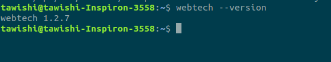

### Available Options in webtech

<h4>Usage : webtech Option 
Example : webtech --version</h4>

---
|Option|Function|
|:---|:---|
|--version|shows program's version number and exits|
|-u URLS, --urls=URLS|url(s) to scan|
|--urls-file=URLS_FILE, --ul=URLS_FILE|url(s) list file to scan|
|--user-agent=USER_AGENT, --ua=USER_AGENT|use this user agent|
|--random-user-agent, --rua|use a random user agent|
|--database-file=DATABASE_FILE, --db=DATABASE_FILE|custom database file|
|--json, --oj|output json-encoded report|
|--grep, --og|output grepable report|
|--update-db, --udb|force update of remote db files|
|--timeout=TIMEOUT|maximum timeout for scrape requests|
|-h, --help|shows the help message and exits|
